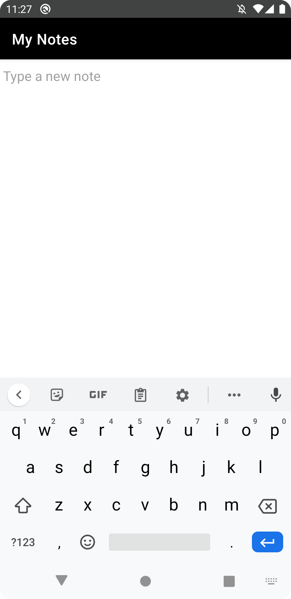
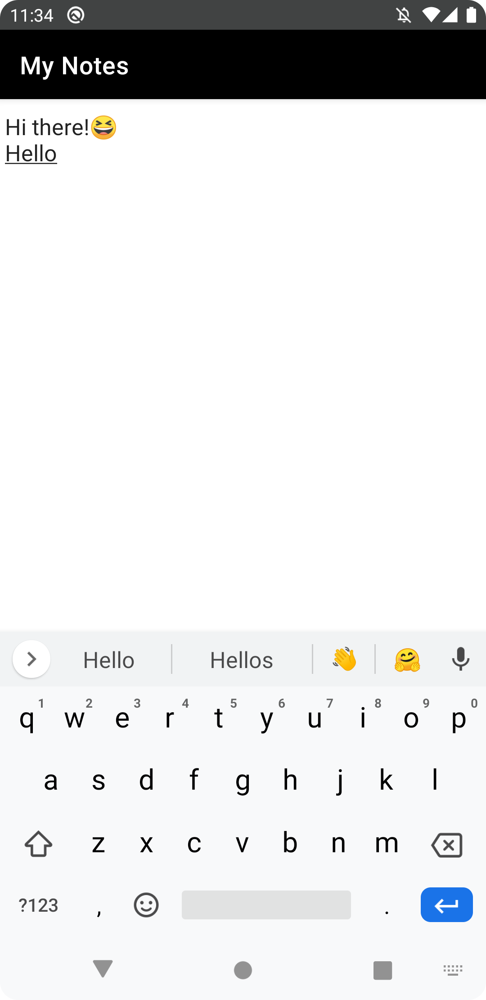
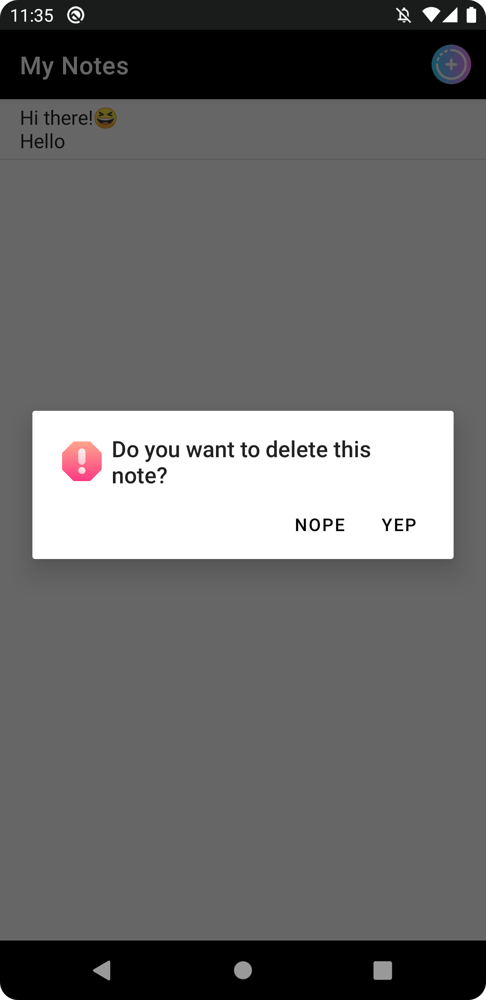

# Simple Notes Android App 🗒️

A notes app that implements CRUD Operations using Shared Preferences as local storage.
This app allows users to create a new note with plain text or even with emoji 😎 in it.
The note will automatically be saved to local storage without needing to tap the save button.

## Technologies Used
- Java
- XML
- Android Studio

## Screenshots

#### This is the main page of the app. It will show all your notes.

#### When you tap the add note button, it will show you this blank page to type your new note.

#### You can also edit your saved note by tapping it from the main page.

#### If you want to delete your note, you can long tap on it from the main page and delete the note.

## Download Link
[Give it a try! 📲](https://www.mediafire.com/file/ztsa87xzpt99pco/Simple_Notes_App.apk/file)
